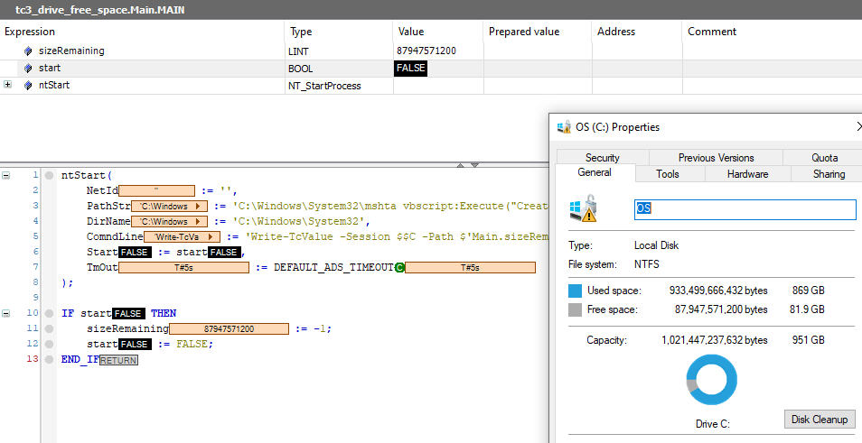

# Proof of concept, Hard drive free space using Tc3, NT_StartProcess and Powershell

## Disclaimer
This is a personal guide not a peer reviewed journal or a sponsored publication. We make
no representations as to accuracy, completeness, correctness, suitability, or validity of any
information and will not be liable for any errors, omissions, or delays in this information or any
losses injuries, or damages arising from its display or use. All information is provided on an as
is basis. It is the reader’s responsibility to verify their own facts.

The views and opinions expressed in this guide are those of the authors and do not
necessarily reflect the official policy or position of any other agency, organization, employer or
company. Assumptions made in the analysis are not reflective of the position of any entity
other than the author(s) and, since we are critically thinking human beings, these views are
always subject to change, revision, and rethinking at any time. Please do not hold us to them
in perpetuity.

## Overview 
This is a proof of concept that you can use NT_StartProcess (with powershell) to obtain the free space of a drive.  This is only a proof of concept, and as such you should look to apply a more stable solution.  NT_StartProcess allows us to run external programs from TwinCAT 3.  The main problem is that you are unable to capture any return values.  This lead to a challenge.  Is it possible to write a mini powershell script which can do the task, create an ads connection, report back the results, all while being invisible to the user, all compacted in to the 510 character limit of NT_StartProcess?  The answer in this case is, yes, yes you can.  Should you?  I don't think so, but that is for you to decide. 

## Getting Started
You will need to install the TcXaeMgmt module in to Powershell on the target which this project will be run. Instructions can be found [here](#install-of-tcxaemgmt).

Once done, run the program on your target and set the "start" variable to true.  You will then see sizeRemaining change from -1 to the available space in bytes after a few seconds.

## Screenshot


## Code Snippets
We have 2 main limitations with NT_StartProcess.  The first is that we are unable to return values directly from the executed application.  Secondly we are limited to T_MaxString as input parameters (strings of 255 characters).  The input parameter size can be doubled by spreading both path and arguments across both PathStr and ComndLine parameters.  These are concat together which means you have 510 characters to play with.  

Building the layers of this example, we start with the program we will execute.  First, we will create the standard code in Powershell.
```powershell
$volume=Get-Volume -DriveLetter C
$route=get-adsroute -local;
$session=New-TcSession -Route $route -Port 851;
Write-TcValue -Session $session -Path 'Main.sizeRemaining' -value $volume.SizeRemaining -Force; 
Close-TcSession -InputObject $session;
```
This finds the local ads router, creates a session on port 851.  Then writes the volume size remaining to the variable "Main.sizeRemaining" and closes the session.  You can verify this code works as expected by running it directly in powershell.  If the variable stays at -1 then you know the code was not successfully executed. 

We then remove all new lines and minify the symbol names to condense the code.

To execute this on cmd you can use 
```bash
powershell -c $B=Get-Volume -DriveLetter C;$C=get-adsroute -local;$A=New-TcSession -Route $C -Port 851;Write-TcValue -Session $A -Path 'Main.sizeRemaining' -value $B.SizeRemaining -Force; ;Close-TcSession -InputObject $A;
```

We could now execute this directly using NT_StartProcess but this would causes the powershell window to pop-up which is not ideal.  

In order to hide this we can use mshta to execute vbscript directly from the command line.

```
C:\Windows\System32\mshta vbscript:Execute(<<vb script goes here>>)
``` 

So combining the whole command together results in the following.
```bash
C:\Windows\System32\mshta vbscript:Execute("CreateObject(""WScript.Shell"").Run ""powershell -c $B=Get-Volume -DriveLetter C;$C=get-adsroute -local;$A=New-TcSession -Route $C -Port 851;Write-TcValue -Session $A -Path 'Main.sizeRemaining' -value $B.SizeRemaining -Force; ;Close-TcSession -InputObject $A;"", 0: window.close")
```

The final step was to escape the $ using $$ in TwinCAT and to split the string across the two parameters. 
```
ntStart(
	NetId := '',
	PathStr := 'C:\Windows\System32\mshta vbscript:Execute("CreateObject(""WScript.Shell"").Run ""powershell -c $$A=Get-Volume -DriveLetter C;$$B=get-adsroute -local;$$C=New-TcSession -Route $$B -Port 851;',
	DirName := 'C:\Windows\System32',
	ComndLine := 'Write-TcValue -Session $$C -Path $'Main.sizeRemaining$' -value $$A.SizeRemaining -Force;Close-TcSession -InputObject $$C;"", 0: window.close")',
	Start := start,
	TmOut := DEFAULT_ADS_TIMEOUT
);
```

## Install of TcXaeMgmt

To do so (if you have no internet connection), open Powershell as administrator and execute this on cmd
```bash
Set-ExecutionPolicy -ExecutionPolicy RemoteSigned
```

Then go to folder .\src\powershell\TcXaeMgmt and execute as administrator.

```bash
install.bat 
```

The folder ``` C:\Program Files\WindowsPowerShell\Modules\TcXaeMgmt\3.2.25 ``` should look like this:

## Screenshot


You can download the offline package by yourself at: https://www.powershellgallery.com/packages/TcXaeMgmt/3.2.25

## Versions
* TcXaeShell 3.1.4024.35
* TcXaeMgmt 3.2.25 for Powershell (instructions included in Main.POU)

## Need more help?
Please visit http://beckhoff.com/ for further guides

Coding byte video series found [here](https://codingbytes.teachable.com/p/codingbytes)
